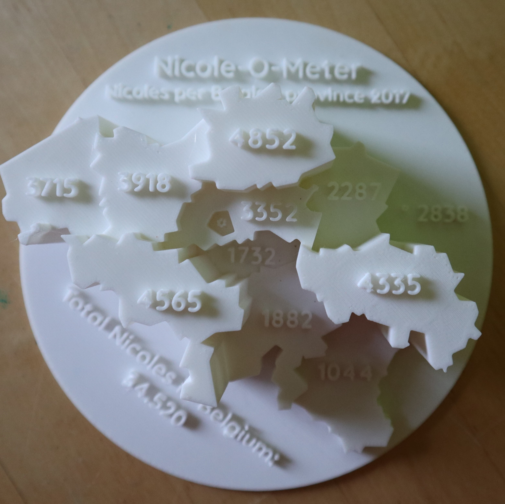
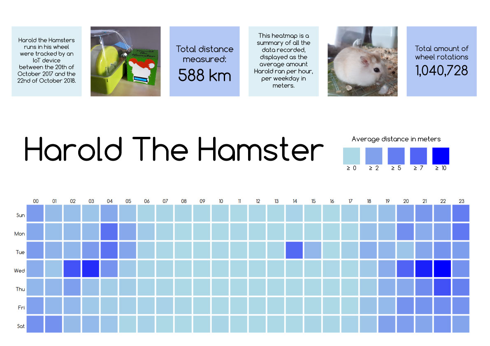
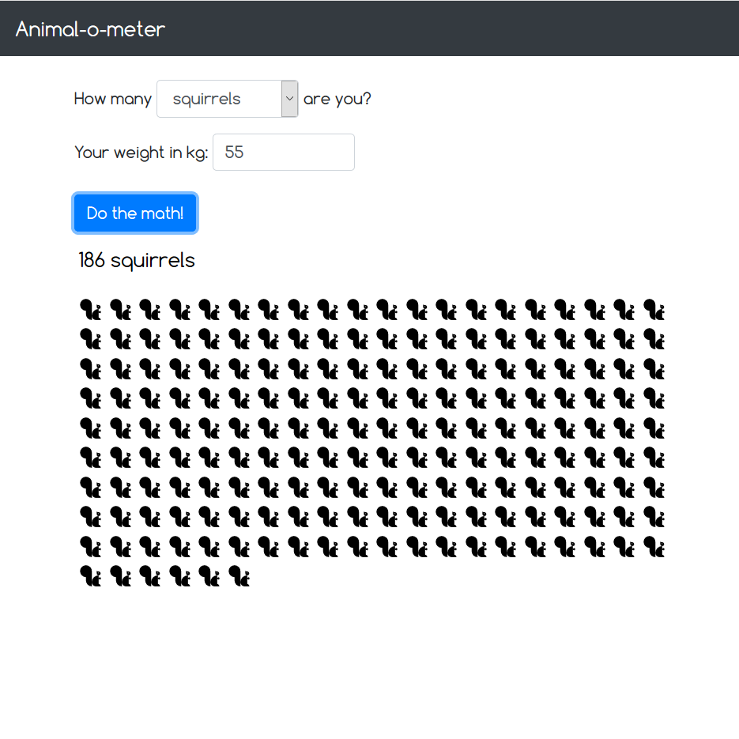
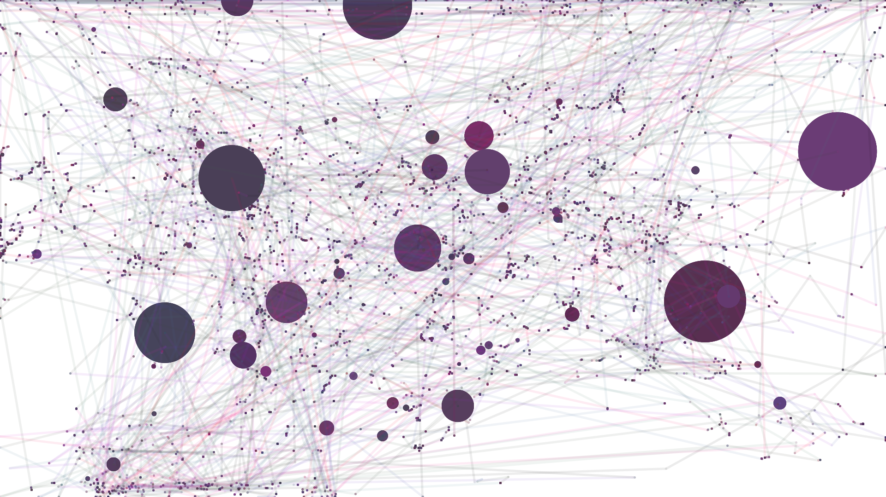

# DataVisualisation
Nicole's assignments for the class Data Visualisation MCT3, 2018-2019.

## Assignment 1: Nicole-O-Meter

### Process
I found some cool data on the amount of Nicole's per city on the website of the Belgian government.

Data source: [Voornamen van de totale bevolking per gemeente, STATBEL.](https://statbel.fgov.be/nl/open-data/voornamen-van-de-totale-bevolking-gemeente)

### Goal
Create a 3D map displaying interesting data about the amount of Nicole's and their location within Belgium.

### Properties
Intent: A.1 Explanatory

Media: B Physical

Appearance: A.2 Static

Other: A.x 3D

### Results
A 3D printed map of Belgium, showcasing the absolute number of Nicole's per province. The height of each province correlates with the amount of Nicole's living there in 2017.

### Sources
[Voornamen van de totale bevolking per gemeente, STATBEL.](https://statbel.fgov.be/nl/open-data/voornamen-van-de-totale-bevolking-gemeente)  Date of reference: 14th of October 2018.
[Low SVG map of Belgium, AmCharts](https://www.amcharts.com/svg-maps/)  Date of reference: 23rd of October 2018.

## Assignment 2: Hamster-O-Meter

### Process
Last year, I created [an IoT device to track my hamsters runs in his hamster wheel.](http://8bitsandabyte.com/project-floofball-an-iot-hamster-wheel/)

Over the course of a year, I collected quite a lot of interesting (semi reliable) data. It would be a waste not to analyse the data and make something nice.

### Goal
Create a heat map displaying when Harold ran the most and least per hour and per weekday.

### Properties
Intent: A.1 Explanatory

Appearance: A.2 Linear / Interactive

Other: A.x D3.js

### Results
An interactive heat map visualising Harold's running data, created using D3.js.

An interesting poster to showcase at the Clash of Sounds.

Please note that loading the CSV file doesn't work in Chrome and Internet Explorer, so the heat map doesn't show up.
However, it does work nicely in Firefox and Microsoft Edge.

### Sources
[Lynda D3 JS Essential Training for Data Scientists](https://www.lynda.com/D3-js-tutorials/D3-js-Essential-Training-Data-Scientists/504428-2.html) Date of reference: 26th of November 2018
[Building a simple heat map with D3, Jeffrey Everhart](https://jeffreyeverhart.com/2016/03/12/heat-map-d3/) Date of reference: 26th of November 2018
[Day/hour heatmap in v4, takayki](http://bl.ocks.org/ganezasan/dfe585847d65d0742ca7d0d1913d50e1) Date of reference: 26th of November 2018
[D3.js Tutorial: Building interactive bar chars with JavaScript, Mate Huszarik](https://blog.risingstack.com/d3-js-tutorial-bar-charts-with-javascript/) Date of reference: 26th of November 2018
[Comfortaa, Google Fonts](https://fonts.google.com/specimen/Comfortaa?selection.family=Comfortaa) Date of reference: 26th of November 2018

## Assignment 3: Sounds-Like-Running-O-Meter

### Process
During my work on assignment 2, the Hamster-O-Meter, I created an interesting dataset using D3.js: the hourly average of Harold's runs in his hamster wheel.

Personally, I thought it would be a waste not to try capturing this data in another way: sound.

### Goal

### Properties
Intent: A.1 Exploratory

Media: B Auditive

Appearance: A.2 Linear

Other: A.x Node-based

### Results
The result is a sonification of Harold's runs in his hamster wheel, made with Pure Data. The more he runs per hour, the faster the running sounds are.
Below is the waveform of the data sonification, created using [this waveform generation website.](http://convert.ing-now.com/generate-a-waveform-image-from-an-audio-file/) A .wav file of the sonification can be found in the folder Assignment 3.

### Sources
[Running gravel or dry leaves loop, FreeSound](https://freesound.org/people/bevangoldswain/sounds/54778/) Date of reference: 10th of January 2019.
[Generate a waveform image from an audio file, converting now](http://convert.ing-now.com/generate-a-waveform-image-from-an-audio-file/) Date of reference: 14th of January 2019.

## Assignment 4: Animal-O-Meter

### Process
I've always loved the interactive installations often seen in zoos, where you can weigh yourself and see how many times your body weight fits in an elephant.

### Goal
Create a version of this zoo installation, where people can compare their body weight to the weight of a number of animals.

### Properties
Intent: A.1 Explanatory

Appearance: A.2 Interactive

Other: A.x D3

### Results
An interactive webpage where you can select an animal and enter your weight, to see how many of an animal you are.
The animals and their weights are dynamically loaded into the page, so it's easy to customize. The visualisation was made using D3.js.

### Sources
[Animal Icon Set for Adobe XD, Behance](https://www.behance.net/gallery/64609807/Animal-Icon-Set-for-Adobe-XD?scid=social76163047&adbid=1824036584306333&adbpl=fb&adbpr=341657335877606) Date of Reference: 25th of December 2018.
[Bootstrap 4, W3 schools](https://www.w3schools.com/bootstrap4/default.asp) 3rd of January 2019
[House mouse, Wikipedia](https://en.wikipedia.org/wiki/House_mouse) Date of Reference: 25th of December 2018.
[Barn owl, Wikipedia](https://en.wikipedia.org/wiki/Barn_owl) Date of Reference: 25th of December 2018.
[Cat, Wikipedia](https://en.wikipedia.org/wiki/Cat) Date of Reference: 25th of December 2018.
[Holland Lop, Wikipedia](https://en.wikipedia.org/wiki/Holland_Lop) Date of Reference: 25th of December 2018.
[Booted Bantam, Wikipedia](https://en.wikipedia.org/wiki/Booted_Bantam) Date of Reference: 25th of December 2018.
[Black mamba, Wikipedia](https://en.wikipedia.org/wiki/Black_mamba) Date of Reference: 25th of December 2018.
[Round sardinella, Wikipedia](https://en.wikipedia.org/wiki/Round_sardinella) Date of Reference: 25th of December 2018.
[Leatherback sea turtle, Wikipedia](https://en.wikipedia.org/wiki/Leatherback_sea_turtle) Date of Reference: 25th of December 2018.
[Red squirrel, Wikipedia](https://en.wikipedia.org/wiki/Red_squirrel) Date of Reference: 25th of December 2018.
[Medium dog breeds, Your Pure Bred Puppy](https://www.yourpurebredpuppy.com/dogbreeds/index-medium-dog-breeds.html) Date of Reference: 25th of December 2018.
[How much do butterflies weigh? The Children's Butterfly Site](https://www.kidsbutterfly.org/faq/general/11) Date of Reference: 25th of December 2018.

## Assignment 5: Mouse-O-Meter

### Process
Like a lot of people, I use my computer most of the day. What if I could create art whilst going about my daily business?

### Goal
The goal is to capture the movements of the mouse on the computer screen, and visualize them in an interesting way.

### Properties
Intent: A.1 Exploratory

Appearance: A.2 Interactive

### Results
The result is a Processing program that tracks mouse movements and visualises it, as displayed below.

### Sources
[Global mouse tracker, Processing forum](https://forum.processing.org/one/topic/global-mouse.html) Date of reference: 13th of January 2019.
[Changing colour of shapes over time, Processing forum](https://forum.processing.org/two/discussion/25166/changing-colour-of-shapes-over-time) Date of reference: 14th of January 2019.
